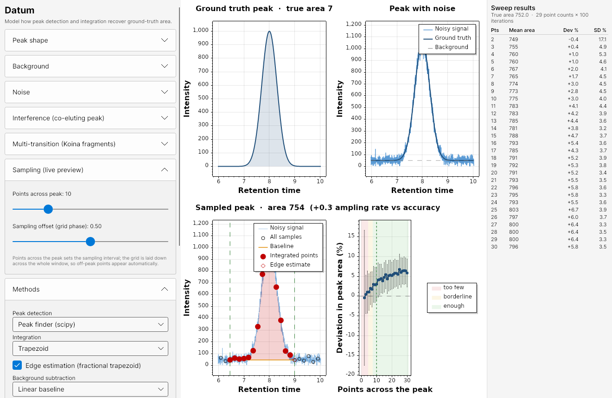
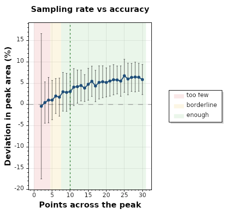
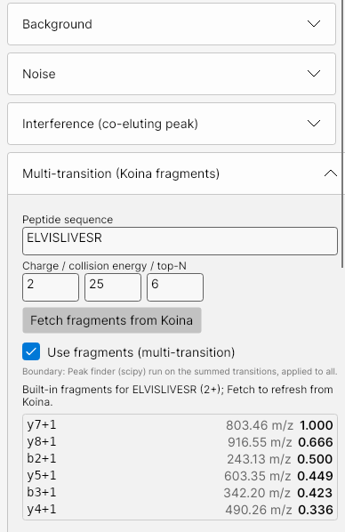
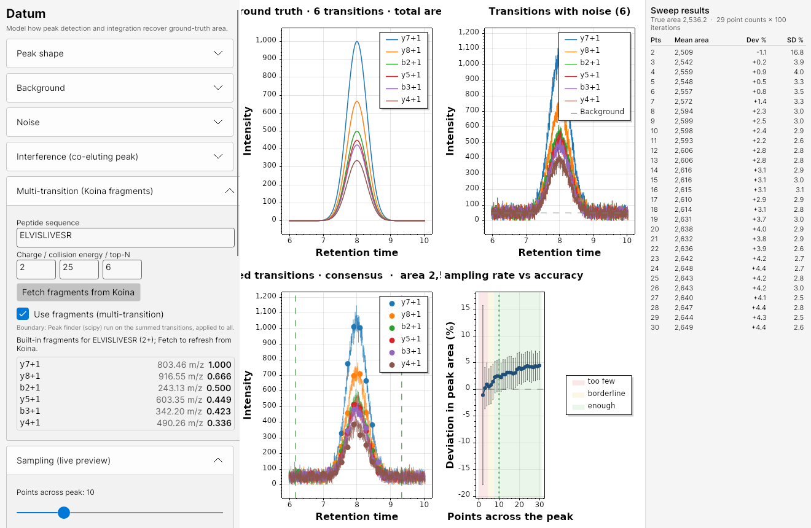

# datum

[](https://github.com/maccoss/datum/actions/workflows/ci.yml)

An application to test and evaluate chromatography methods.

Datum is a cross-platform desktop app for modeling how chromatographic **peak detection** and
**area integration** algorithms recover the true peak area under realistic distortions: peak
skew, chemical background, signal-dependent (Poisson/shot) noise, signal-independent (Gaussian)
noise, and co-eluting interference. It also quantifies the classic effect of **sampling rate**
(points across the peak) on quantification accuracy and precision.



The four panels show, clockwise from top-left: the noise-free **ground-truth** peak (with its
true area shaded), the **peak with noise** (noisy signal over the ground truth and the chemical
background), the **deviation vs points-across-peak** curve from a Monte-Carlo sweep, and the
**sampled peak** with the detected boundaries, integrated points, and integrated area.

## Why

Quantification in targeted and DIA proteomics depends on integrating a peak that is only ever
*sampled* a handful of times across its width, on top of background and noise. Datum lets you
dial in a peak and its distortions, pick a detection/integration/background-subtraction method,
and see exactly how far the recovered area strays from the truth, and how that improves as you
add points across the peak. The ~10-points-per-peak rule of thumb falls straight out of the
deviation plot.

## Features

- **Peak shapes:** Gaussian, skew-normal (tailing/fronting), and exponentially-modified
  Gaussian (EMG).
- **Distortions:** constant/linear/curved chemical background, additive Gaussian noise,
  Poisson (shot) noise, and a configurable co-eluting interference peak.
- **Sampling:** points across the peak (sets the interval) and a sampling offset, all live;
  off-peak points appear automatically across the window.
- **Pluggable algorithms** (selectable in the UI, easy to extend):
  - *Detection:* threshold crossing, a port of SciPy `find_peaks` + `peak_widths`,
    **Osprey** median-CWT consensus, and two **Skyline** modes: "boundaries only" (Skyline
    boundaries with your choice of area method) and "exact area" (Skyline boundaries plus
    Skyline's own area calculation, which fixes and greys out the area options).
  - *Integration:* trapezoid (with optional fractional-trapezoid **edge estimation**),
    Riemann sum, Gaussian fit, EMG fit, **Consensus EMG** (one shared shape across transitions with
    a robust per-transition amplitude, so interference on a minority of transitions is rejected; see
    [docs](docs/consensus-emg-integration.md)), and **Skyline** (area minus straight-line background).
  - *Background subtraction:* none, constant, and linear baseline (subtracted per transition, so each
    transition may carry its own background).
- **Multi-transition modeling with Koina:** fetch the top-N predicted fragment intensities for
  a peptide (Prosit_2020_intensity_HCD) and model several precursor>product transitions that
  share one elution profile, quantified with Osprey's median-CWT consensus (which rejects
  single-transition interference).
- **Monte-Carlo sweep** over points-across-peak with mean deviation and variance, reproducing
  the deviation-vs-sampling figures from the literature.

## Download

Prebuilt builds are produced by CI for Linux, Windows, and macOS (Intel and Apple Silicon) on
the [Releases](https://github.com/maccoss/datum/releases) page:

- **Windows:** run `datum-setup-<version>-win-x64.exe` (Intel/AMD) or
  `datum-setup-<version>-win-arm64.exe` (Windows on ARM) — installers with a Start Menu shortcut —
  or use the portable `datum-win-x64.zip` / `datum-win-arm64.zip`.
- **Linux:** install `datum_<version>_amd64.deb` (`sudo apt install ./datum_<version>_amd64.deb`,
  then run `datum`), or use the portable `datum-linux-x64.tar.gz`.
- **macOS:** download `datum-osx-arm64.tar.gz` (Apple Silicon) or `datum-osx-x64.tar.gz`
  (Intel), unpack, and run `Datum.App`. An unsigned build needs a right-click and "Open" the
  first time (see Installers below).

All builds are self-contained: no .NET runtime or other dependency is required.

## Getting started

### Prerequisites

- [.NET 8 SDK](https://dotnet.microsoft.com/download) (8.0 or later).
- A desktop environment. On Windows this is native; on Linux/WSL2 you need a display server
  (WSLg provides one out of the box).

### Build and run

```bash
make run            # or: dotnet run --project src/Datum.App
make test           # run the engine unit tests
make check          # format + build with warnings as errors
```

The first launch renders the live preview immediately. Adjust any parameter on the left and the
top-left, top-right, and bottom-right plots update live; click **Run simulation** to compute the
deviation-vs-sampling curve (bottom-left).

## How to use it

The left panel is grouped into collapsible sections:

1. **Peak shape** - choose Gaussian, skew-normal, or EMG and set height, center (retention
   time), width (sigma), and skew/tau.
2. **Background** - none, constant, linear, or curved baseline.
3. **Noise** - Gaussian noise sigma (signal-independent), a Poisson toggle (signal-dependent),
   and the display seed.
4. **Interference** - enable a co-eluting peak defined relative to the main peak (relative
   amplitude, center offset in sigma, sigma ratio, skew).
5. **Multi-transition (Koina)** - see below.
6. **Sampling (live preview)** - points across the peak (this sets the sampling interval) and a
   sampling offset that phases the grid relative to the peak. The grid is laid down across the
   whole window, so off-peak baseline points appear automatically (no separate flanking control).
7. **Methods** - pick the detector, integrator (with an edge-estimation toggle), and background
   subtractor, plus boundary relative height and detection thresholds.
8. **Simulation sweep** - min/max points, iterations per point count, and seed, then
   **Run simulation**.

### Reading the deviation plot



Each marker is the mean percent deviation of the recovered area from the truth at that sampling
rate; the error bars are the standard deviation across Monte-Carlo replicates. The shaded bands
("too few", "borderline", "enough") and the dotted line at ~10 points mark the rule of thumb.
With naive trapezoid integration the curve dives strongly negative at low sampling (the peak is
undersampled); turning on **edge estimation** flattens that bias, and precision (the error bars)
tightens as points increase. Add background plus interference and the variance grows, but linear
baseline subtraction keeps the mean near zero.

### Multi-transition with Koina



Enter a peptide sequence, precursor charge, and collision energy, set top-N, and click
**Fetch fragments from Koina**. The app calls the public Koina server
(`Prosit_2020_intensity_HCD`) and lists the top fragments with their m/z and base-peak-normalized
relative intensities. Tick **Use fragments (multi-transition)** and run the
sweep: each transition is modeled as the shared elution profile scaled by its relative intensity
with independent noise, and detection uses Osprey's median-CWT consensus across transitions. If
the Koina server is unreachable, the app falls back to a synthetic fragment ladder so the feature
stays usable offline.

When multi-transition mode is on, the three chromatogram panels overlay each transition in its
own color: the ground-truth panel shows the per-transition peaks (scaled by relative intensity)
and the total area, the noisy panel shows each transition's noisy XIC, and the sampled panel
shows the per-transition sampled points with the single set of consensus-detected boundaries. The
deviation panel reports the summed, consensus-quantified area.



## Architecture

```text
Datum.sln
  src/Datum.Core    Simulation engine: peak models, noise, sampling, the pluggable
                    detector/integrator/background-subtractor algorithms, and the
                    Monte-Carlo + multi-transition engines. No UI dependencies.
  src/Datum.Koina   Koina HTTP client (KServe v2) for fragment-intensity prediction.
  src/Datum.App     Avalonia (MVVM) desktop UI with ScottPlot panels.
  tests/Datum.Core.Tests   xUnit tests for the engine and algorithms.
```

The algorithms are registered in `AlgorithmRegistry`; adding a new `IPeakDetector`,
`IIntegrator`, or `IBackgroundSubtractor` makes it appear in the UI automatically. See the
developer guides:

- [Adding a peak-boundary (detector) model](docs/extending-detectors.md)
- [Adding a peak-area (integrator) model](docs/extending-integrators.md)

### Algorithm provenance

- **Skyline** is reproduced **byte-identically** by vendoring Skyline's actual managed peak
  finder and area math from [ProteoWizard/pwiz](https://github.com/ProteoWizard/pwiz)
  (Apache-2.0). See [how Skyline is replicated exactly](docs/skyline-replication.md).
- **Osprey CWT detector** is a faithful port of the Mexican-hat median-consensus peak detection
  from [Osprey](https://github.com/maccoss/osprey) (`osprey-chromatography/src/cwt.rs`). See
  [how the Osprey CWT detector is replicated](docs/osprey-cwt-replication.md).
- **Osprey CWT (improved)** keeps that consensus apex but places fractional integration boundaries
  at a fixed multiple of the peak standard deviation so the recovered area is independent of
  sampling density. See [the improved boundary and integration model](docs/improved-integration-model.md).
- **find_peaks detector** is a port of `scipy.signal.find_peaks` + `peak_widths`.
- **Koina** fragment intensities come from the
  [Koina](https://koina.proteomicsdb.org/) inference service.

## Notes

- Screenshots in `docs/images/` are generated from the app itself: set `DATUM_AUTORUN=1`
  (run the sweep on startup), optionally `DATUM_MULTI=1` (fetch Koina + multi-transition), and
  `DATUM_SHOT=<path>` (render the window to a PNG and exit). These env vars are inert in normal
  use.
- The engine is deterministic given a seed, so runs are reproducible.
- **Window placement:** the window opens centered on the primary monitor (the monitor at the
  virtual-desktop origin). Some compositors, notably WSLg, report no monitor as "primary", so the
  origin monitor is used as the primary. If it still opens on the wrong screen, run with
  `DATUM_SCREEN_DEBUG=1` to print the detected monitor layout, then set `DATUM_SCREEN=<index>` to
  force a specific monitor. Note that **WSLg ignores client window positioning** entirely (it
  opens windows on the monitor under the mouse cursor), so under WSLg the override may have no
  effect — move the mouse to the target monitor before launching, or run the native Windows build
  (which respects monitor placement and `WindowStartupLocation`).

## Continuous integration and releases

- **CI** (`.github/workflows/ci.yml`) builds and runs the test suite on Linux, Windows, and
  macOS for every push and pull request, plus a `dotnet format` check.
- **Release** (`.github/workflows/release.yml`) builds self-contained, single-file apps for
  `linux-x64`, `win-x64`, `win-arm64`, `osx-x64`, and `osx-arm64`; produces Windows installers
  (x64 and ARM64) and a Linux `.deb`; and creates a GitHub Release whose body is the matching
  `release-notes` file. Cut a release by finalizing the notes and pushing a version tag (see
  [release-notes/README.md](release-notes/README.md)):

  ```bash
  git mv release-notes/RELEASE_NOTES_next.md release-notes/RELEASE_NOTES_v26.1.0.md
  # edit the title, recreate an empty next, bump <Version> in Directory.Build.props, commit
  git tag v26.1.0 && git push origin main --tags
  ```

  You can also run the workflow manually (workflow_dispatch) to produce the artifacts without
  tagging or releasing.

### Versioning and release notes

Datum uses `YY.feature.patch` versioning (e.g. `26.1.0`); the canonical version is `<Version>`
in `Directory.Build.props`. Each release has a `release-notes/RELEASE_NOTES_v{version}.md` file;
the unreleased draft lives in `release-notes/RELEASE_NOTES_next.md`. The release workflow fails
if the notes file for the tag is missing. See [release-notes/README.md](release-notes/README.md).

### Installers

- **Windows:** Inno Setup installers for both architectures (`datum-setup-<version>-win-x64.exe`
  and `datum-setup-<version>-win-arm64.exe`) are built by CI (`packaging/windows/datum.iss`); they
  install to Program Files with a Start Menu shortcut.
- **Linux:** a `.deb` (`packaging/linux/build-deb.sh`) installs the app under `/opt/datum`, a
  `datum` launcher on `PATH`, and a desktop entry.
- **macOS:** no installer yet. The portable `.app`/tarball works, but an unsigned app triggers a
  Gatekeeper warning; removing it requires an Apple Developer ID and notarization (a paid
  account). Until then, right-click and "Open" once.

## License

Apache 2.0. See [LICENSE](LICENSE).
